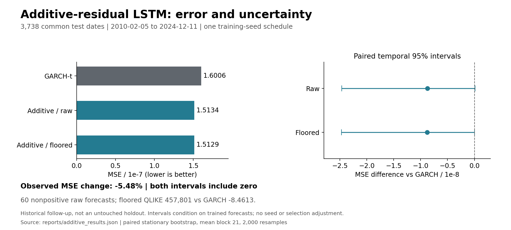

# RNN Volatility Lab

A controlled study of one-day S&P 500 variance forecasts using GARCH, LSTM, GRU, and positive hybrid models.

**Status:** corrected historical walk-forward experiments, including the restored additive-residual LSTM control. The original implementation defects have been repaired and regression-tested. This is a single-seed research prototype, not a trading-alpha claim or production model.

[](https://github.com/SRG-eddieliu/rnn-volatility-lab/actions/workflows/tests.yml)



## Quick Offline Demo

```bash
python -m pip install -r requirements-test.txt
python scripts/smoke_demo.py
python -m unittest discover -s tests -v
```

No account, API key, market download, or TensorFlow is needed. The demo generates
synthetic returns, fits a small rolling GARCH baseline, checks forecast timing,
and evaluates GARCH/EWMA on common dates. **It does not reproduce the historical
results above or train an LSTM.** Full research reproduction is documented below.
CI runs the lightweight suite on pushes; manual workflow runs also test TensorFlow.
The figure is rebuilt with `python reports/build_readme_figure.py` from committed
aggregate evidence, without rerunning or modifying the historical experiment.

## Research and Results

- [Latest: additive residual follow-up (4 pages)](reports/volatility-additive-residual.pdf)
- [Combined follow-up, original corrected study, and appendix (17 pages)](reports/volatility-research-with-appendix.pdf)
- [Additive comparison and evidence](reports/additive_residual_report.md)
- [Additive aggregate results and source hashes](reports/additive_results.json)
- [Original corrected study (8 pages)](reports/volatility-research.pdf)
- [Original corrected technical appendix (5 pages)](reports/volatility-diagnostics.pdf)
- [Original nine-specification results summary](reports/research_report.md)
- [Aggregate results, uncertainty estimates, and source hashes](reports/corrected_results.json)
- [Experiment plan](docs/corrected-experiment-plan.md)
- [Validation scope and remaining limitations](docs/validation-status.md)

The corrected run compares **nine forecast specifications on 3,738 identical dates**, February 5, 2010 to December 11, 2024. Six neural specifications each complete 178 expanding-window folds, alongside GARCH-t, lagged 21-day historical variance, and EWMA(0.94).

Results are reported whether or not a neural model improves on a simple baseline. The analysis distinguishes implementation correctness, positivity, calibration, and loss-based performance. No strategy P&L or Sharpe-ratio improvement is claimed.

**Latest additive result:** restoring the original signed-residual MSE objective lowers observed MSE by **5.48%** versus corrected GARCH, from `1.600623e-7` to `1.512933e-7` after the original fixed floor. The unbounded version improves MSE by **5.45%**, so the change is not mainly a clipping effect. However, there are **60 nonpositive raw forecasts**, clipped QLIKE is approximately **457,801** versus GARCH's **-8.4613**, and the 95% paired temporal interval for the MSE difference includes zero. This is an observed MSE improvement, not demonstrated robust or deployable variance forecasting.

The additive follow-up fits one additional LSTM across the same 178 folds, with unchanged data, benchmark files, architecture, seed schedule, and training budget. It is separate from the initial nine-specification run. In that initial run, GARCH beat the log-target and log-ratio candidates in MSE and QLIKE. The two objectives must not be conflated; see the [fixed follow-up plan](docs/additive-residual-plan.md).

## What Was Corrected

1. **GARCH state updating:** new returns update conditional variance every day, even when parameters are held fixed between 21-observation refits.
2. **Target inverse:** `log(max(y, eps))` is inverted by exponentiation, without an inconsistent epsilon subtraction.
3. **Comparable neural histories:** all neural candidates now have identical train/validation/test dates and a full initial training history after GARCH warmup.
4. **Distinct hybrid objectives:** log-ratio hybrids use `h = g * exp(predicted_log_ratio)` for positivity. The subsequent additive control restores `h = g + predicted_residual` and original-scale residual MSE, retaining raw and fixed-floor outputs separately.
5. **Reproducibility and diagnostics:** seeds are set before model construction; checkpoint losses are evaluated at the same restored weights; run signatures and completion checks prevent mixed or partial artifacts.

These repairs do not eliminate the difference between a log-MSE objective and arithmetic conditional-mean variance. The report treats that as a modeling limitation, not as a solved implementation issue.

## Data and Model Design

The cached `^GSPC` daily-price snapshot covers 2003-2024. The target is squared daily log return, a noisy second-moment proxy; its interpretation as conditional variance assumes a zero conditional mean.

Pure neural inputs are 21 lagged rows of log return, squared return, absolute return, and annualized 21-day rolling volatility. Hybrids add lagged GARCH variance. Forecast targets and losses use daily variance, not annualized volatility.

After common feature availability, the initial 777-row training span yields 756 sequences. Validation has 252 observations; test blocks have 21 and do not overlap. Training expands over time. An incomplete trailing test block is excluded.

Neural settings: 8 units, dropout 0.1, Adam 0.001, batch 64, maximum 35 epochs, patience 6, primary seed 42 plus split ID. CPU execution uses unrolled recurrence for the fixed short sequence.

## Reproduce

Use an isolated environment. The tested research configuration is Python 3.10.16 on macOS arm64; pinned package versions are in [requirements-research.txt](requirements-research.txt). Bitwise equivalence on other platforms is not guaranteed.

```bash
python -m pip install -r requirements-research.txt
python -m unittest discover -s tests -v
RUN_TF_TESTS=1 python -m unittest discover -s tests -v

python scripts/run_corrected_experiment.py \
  --raw data/raw/sp500_raw.csv --out runs/corrected-v1 --prepare
python scripts/run_all_models.py --out runs/corrected-v1 --workers 3
python scripts/evaluate_corrected_experiment.py \
  --out runs/corrected-v1 \
  --vix data/processed/vix_daily.csv \
  --destination reports/corrected_results.json

python -m pip install -r requirements-report.txt
python reports/build_corrected_report.py

# Additive follow-up: preserve the original corrected-v1 directory.
python scripts/run_additive_residual.py \
  --source runs/corrected-v1 --out runs/additive-residual-v1
python scripts/evaluate_additive_residual.py \
  --source runs/corrected-v1 --out runs/additive-residual-v1 \
  --destination reports/additive_results.json
python reports/build_additive_report.py
```

The raw price snapshot, VIX snapshot, complete predictions, gates, and training logs are **not bundled**. Supply appropriately sourced input snapshots; the aggregate artifact records the exact hashes used for this run. Providing different input bytes creates a different experiment. VIX is used only for ex-post gate diagnostics, not as a training feature.

Full training is not a lightweight test. The runner uses separate model processes, bounded worker counts, checkpointed outputs, and run signatures. Reuse an output directory only with matching inputs/code/configuration. Use a separate directory for smoke tests or alternative seeds.

## Evaluation

MSE and QLIKE are computed from identical daily targets. QLIKE is `mean(log(h) + y/h)`, with a fixed `1e-12` numerical floor; lower is better, and values can be negative.

Paired stationary-bootstrap intervals quantify temporal uncertainty in candidate-minus-GARCH loss differences: mean block length 21, 2,000 replications, 95% pointwise percentile intervals, with block-length sensitivity. These are not multiple-comparison-adjusted intervals or measures of training-seed uncertainty.

The additive control is trained on affine-standardized signed residuals, not log ratios. Its raw QLIKE is undefined because of nonpositive forecasts; raw MSE remains reportable. The primary clipped output uses the original `1e-12` floor, with floor sensitivities disclosed rather than selected for favorable test performance.

Calendar diagnostics, level calibration, positive-forecast checks, and gate/VIX summaries accompany the aggregate scores. Gate correlations remain descriptive, not causal explanations or signals.

## Code Map

| Location | Purpose |
| --- | --- |
| [src/data](src/data) | Return features and chronological splits |
| [src/models](src/models) | GARCH recursion, neural fitting, positive reconstruction |
| [src/losses](src/losses) | Original-scale forecast losses |
| [scripts](scripts) | Corrected preparation, training, and evaluation workflow |
| [tests](tests) | Regression, bootstrap, and optional CPU integration checks |
| [reports/build_corrected_report.py](reports/build_corrected_report.py) | PDFs from the public aggregate evidence |
| [docs/validation-status.md](docs/validation-status.md) | Completed checks and unresolved research limits |

The original notebooks and [legacy report generator](reports/generate_pdf_report.py) remain historical examples, not the canonical corrected workflow. Old report PDFs remain in Git history; [review_metrics.json](reports/review_metrics.json) records the pre-rerun historical audit and must not be mixed with corrected-v1.

The byline is Eddie Liu. A provenance note in the reports records the collaborative origin of the original project without naming contributors.
